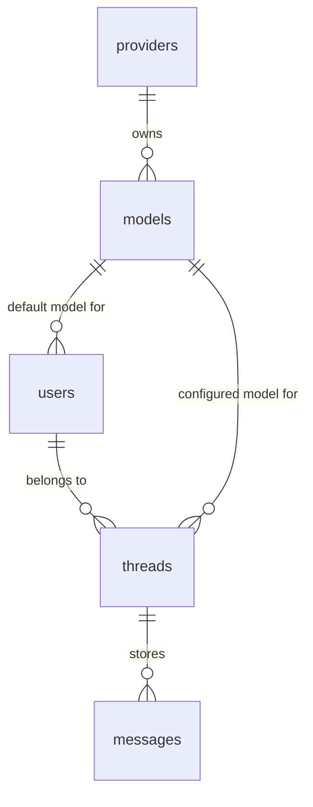

# AI Agent Guild & Codebase Guide

This guide is designed to clarify the architecture, patterns, code organization, and standards of the **Telegram Chatbot** project to facilitate safe, consistent, and effective contributions.

> [!IMPORTANT]
> This guide is a living document. AI agents are required to update `AGENTS.md` whenever changes occur that affect the system design, database schemas, command lifecycle, or development practices, ensuring the guide remains consistently accurate and useful.

---

## 1. Project Overview & Tech Stack

This codebase is a high-performance, stateful Telegram chatbot built using a modern, lightweight runtime and framework:

- **Runtime:** [Bun](https://bun.sh) (utilizes fast package installations, hot-reloading, and Bun APIs like `Bun.serve` and `Bun.write`).
- **Web Server:** [Hono](https://hono.dev) (provides high-performance routing, middleware pipelines, and factory utilities).
- **Database & Query Builder:** PostgreSQL with [Kysely](https://kysely.dev) for type-safe, fluent SQL query building.
- **AI Integration:** [Vercel AI SDK](https://sdk.vercel.ai) with Vercel AI Gateway and [OpenRouter](https://openrouter.ai) providers. Includes real-time message stream drafting.
- **Formatter & Linter:** [Biome](https://biomejs.dev) (super-fast replacement for Prettier and ESLint).
- **Type Safety:** TypeScript.

---

## 2. Directory Layout & Key Modules

The following is the workspace layout for review before making modifications:

```
.
├── src/
│   ├── app.ts                  # Server entrypoint (Bun.serve, Hono server, graceful shutdown)
│   ├── config.ts               # Environment configuration parser & schema validator
│   ├── constant.ts             # Global constants, bot commands, default prompts/keyboards
│   ├── types.ts                # TypeScript interfaces/types for Telegram Bot API & Hono Env
│   ├── util.ts                 # Telegram Bot API wrappers (sendMessage, downloadFile) & general helpers
│   ├── router.ts               # Command-to-handler router & multi-step flow dispatcher
│   ├── cron.ts                 # Background scheduler (inactivity cleaning)
│   ├── database/
│   │   ├── index.ts            # Kysely client, DB pool, and migration runner
│   │   ├── generated-types.ts  # Database types (AUTO-GENERATED by kysely-codegen)
│   │   └── migrations/         # PostgreSQL schema migration scripts
│   ├── repository/
│   │   └── telegram.ts         # Stateful persistence layers (sessions, threads)
│   ├── middleware/
│   │   ├── auth.ts             # Webhook validation, allowed chat checks, thread-only enforcement
│   │   └── logger.ts           # Hono request/response logger
│   └── handler/                # Stateless and stateful business logic handlers
│       ├── chat.ts             # Chat handler & Vercel AI SDK integration
│       ├── choose-model.ts     # Multi-step flow for setting the thread's model
│       ├── fetch-models.ts     # API fetcher for OpenRouter and Vercel AI Gateway models
│       └── ...                 # Command-specific handlers (translator, prompt generator, prompts)
├── Dockerfile                  # Secure, multi-stage production Docker image
├── compose.yaml                # Docker Compose setup for bot and PostgreSQL
├── package.json                # Project scripts and dependencies
├── tsconfig.json               # Path aliases configuration (@/* mapped to src/*)
└── biome.json                  # Biome code formatting & linting configuration
```

---

## 3. Configuration & Secrets Management

The application parses configuration variables strictly in `src/config.ts`.

- **Docker Secret Support:** To support secure secret management in Docker/Kubernetes, the configuration checks for `*_FILE` environment variables (e.g. `TELEGRAM_BOT_TOKEN_FILE`) first, loading the secret from a file synchronously before falling back to plain environment variables.
- **Chat ID Whitelist:** Access control is strictly enforced in `src/middleware/auth.ts` by checking if the incoming chat ID is present in `ALLOWED_CHAT_IDS` parsed from `src/config.ts`.

---

## 4. Database Schema & Architecture

The database structure is designed to persist chat history, active thread states, AI models, and provider metadata.

### Tables Overview

- **`providers`**: Stores AI provider details (`vercel-ai`, `openrouter`).
- **`models`**: Tracks available models, provider mappings, context lengths, descriptions, and whether the model is enabled.
- **`users`**: Details user-level profiles (chat ID is the PK) and their `default_model_id`.
- **`threads`**: Maintains thread-specific configuration (thread ID & chat ID are the PK) including custom system prompts, token usage, context message counts, output format, and the active session state (`command`, `next_step`, `data`).
- **`messages`**: Records conversation history.



### Type-Safe Queries with Kysely

- All queries must use the type-safe `db` query builder exported from `@/database`.
- **DO NOT** write raw SQL unless you are adding a schema migration in `src/database/migrations/` or writing specialized database interactions.
- Whenever the database schema is updated via a migration, run the migration runner to automatically execute Kysely codegen and update the TypeScript types:

  ```bash
  bun run migrate-latest
  ```

  This applies migrations and automatically runs `kysely-codegen` under the hood to update `src/database/generated-types.ts`.

---

## 5. Stateful & Multi-Step Interactions

The chatbot supports conversational commands that require multiple user interactions (e.g., `/enable_model` prompts for a search term, lists matching models, and then waits for a selection).

This is achieved via **Thread Sessions** defined in `src/repository/telegram.ts` and managed in the router (`src/router.ts`):

1. **Routing Strategy:**
   - In `src/router.ts`, before running commands, the router queries the active session for the specific `chatID` and `threadID` using `getSession`.
   - If `session.command` is set, the router overrides the incoming text and dispatches the update to the matching command handler (e.g., `chooseModelHandler`), bypassing standard route matching.
   - If no session is active, it evaluates the incoming command or defaults to `chatHandler`.

2. **Step Lifecycle in Handlers:**
   - **Step 1 (Trigger):** The user enters `/command`. The handler receives the update, calls `setSession` to set `command = '/command'` and `nextStep = 2`, then returns a prompt.
   - **Step 2 (Response/Action):** The user provides input. The handler intercepts it (since `session.command` is active), processes it, transitions to the next step, or finishes.
   - **Step 3 (Cleanup):** Once the flow finishes or the user cancels, the handler **MUST** call `resetSession` to clear the session so subsequent messages default back to normal chat.

*Example pattern found in `src/handler/enable-model.ts`:*

```typescript
let session = await getSession({ chatID, threadID });
if (!session.next_step) {
  // Init session and set step to 1
  session = await setSession({ chatID, threadID, command: '/enable_model', nextStep: 1 });
}

switch (session.next_step) {
  case 1:
    // Ask for input, transition to step 2
    await setSession({ chatID, threadID, command: session.command, nextStep: 2 });
    return sendMessagePrompt();
  case 2:
    // Process input, clear session
    await resetSession({ chatID, threadID });
    return applyFinalActions();
}
```

---

## 6. Coding Guidelines & Standards

To maintain consistency and code health, these rules must be strictly followed:

### Code Formatting & Styling

- **Linter & Formatter:** Always respect Biome settings (`biome.json`).
  - Line width is limited to **60 characters**. Keep lines short and wrap them elegantly.
  - Double equals (`==`) are strictly forbidden; use triple equals (`===`).
  - Non-null assertions (`!`) are permitted but must be used safely.
  - Before completing any task, the formatting script must be run to automatically clean imports and format code:

    ```bash
    bun run format-fix
    ```

### Path Aliases

- **NO** long relative paths like `../../config` or `../../../database`.
- Always use the mapped path aliases configured in `tsconfig.json`:
  - `@/` maps to `src/` (e.g., `@/config`, `@/database`, `@/repository/telegram`, `@/types`).

### AI Operations & Non-Blocking Updates

- **Asynchronous Execution:** Hono routes should respond to Telegram instantly (returning `null` or a fast ack) to avoid request timeouts from the Bot API.
- Deep chatbot interactions (like Vercel AI SDK text streams or vision downloads) must run in the background (using an unawaited async wrapper like `processChat` in `src/handler/chat.ts`).
- **Graceful Error Handling:** Always wrap background tasks in `try/catch` blocks and gracefully intercept promise rejections. If a background action fails, the handler should notify the user over Telegram using `sendMessage` and log the exception.

---

## 7. Operational & Quality Verification Commands

Before proposing code changes or completing a task, verify the project's integrity by executing these commands:

| Command | Action |
|---------|--------|
| `bun run code-check-all` | Runs lint checks, code formatter analysis, and TypeScript compiler checks. **Run this before any commit!** |
| `bun run format-check` | Verifies that all files conform to the Biome formatting rules. |
| `bun run format-fix` | Formats the files and automatically resolves cleanups. |
| `bun run type-check` | Runs the TypeScript compiler in `--noEmit` mode to ensure type compliance. |
| `bun run migrate-latest` | Runs database migrations and recreates generated types. |
| `bun run dev` | Runs the Bun server with hot-reloading. |
| `bun run dev-tools` | Launches the AI SDK DevTools UI for inspecting agent calls and LLM traces. |

---

## 8. Onboarding Checklist for Agents

When implementing a new feature or command:

1. [ ] Check if new environment variables are needed; if so, update `src/config.ts` and `.env.example`.
2. [ ] If changes touch the database, create a migration file in `src/database/migrations/` and run `bun run migrate-latest`.
3. [ ] If a command has multiple interactive steps, utilize the `threads` session columns and register it in `commandHandlers` within `src/router.ts`.
4. [ ] For long running tasks, ensure processing is asynchronous and non-blocking for Hono.
5. [ ] Run `bun run code-check-all` and fix any TypeScript or Biome quality checks.

Adhering to these principles ensures that any new code integrates smoothly into the codebase.
